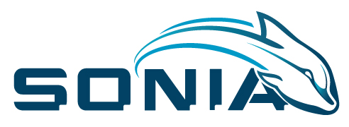

:zap: *A software developed by S.O.N.I.A. team from ETS Montreal* :zap:

## Installation

???

## Launch

???

## Directory Structure

???

## Documentation

???

## Contribute

???

## License

???
